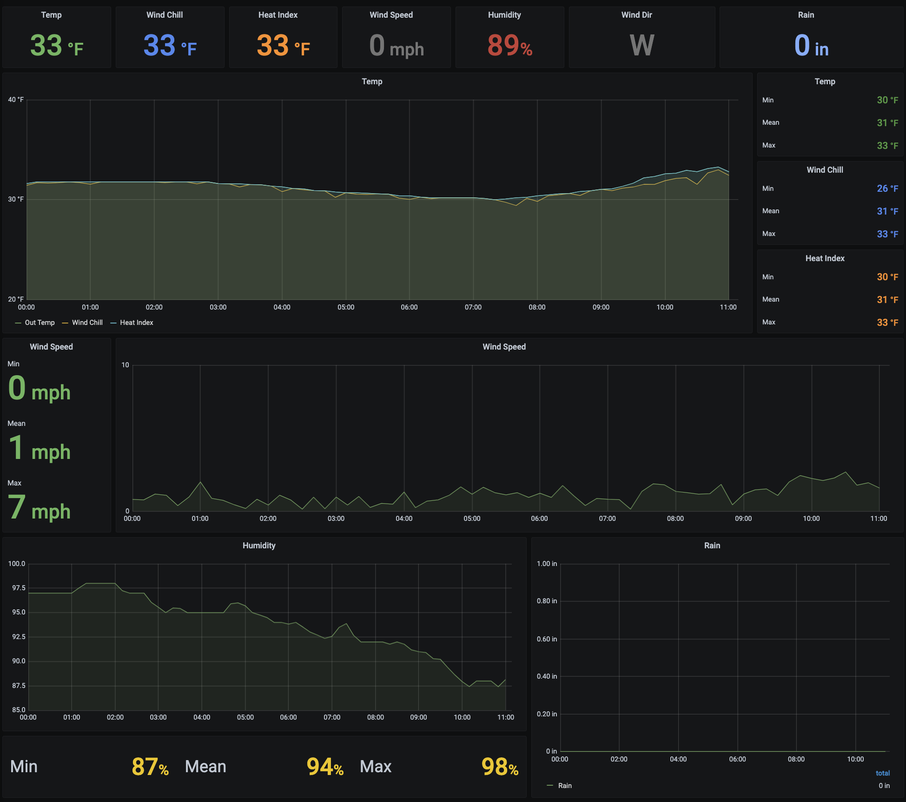

# acurite-weather

Dashboard for weather data collected from Acurite 5-1 weather station. In one of two ways.

1. Indoor Acurite console
   HUGE THANKS TO [WEEWX](http://weewx.com/) FOR DECODING THE VARIOUS MESSAGES FROM THE ACURITE DISPLAY
2. RTL-433

### Config

| Name            | Description                                           | Default               |
| --------------- | ----------------------------------------------------- | --------------------- |
| WS_SOURCE       | determines where to pull data from. CONSOLE or RTL433 | CONSOLE               |
| WS_DEST         | INFLUXDB, STDOUT, or INMEMORY                         | STDOUT                |
| WS_INFLUXDB_URL | influxdb url                                          | http://localhost:8086 |
| WS_INFLUXDB_DB  | influxdb database                                     | weather               |

### Pull latest code

```BASH
git clone https://github.com/deebloo/acurite-weather.git
```

### Run integration and unit tests

```BASH
cargo test --workspace
```

### build and start program

```BASH
docker compose up --build
```


